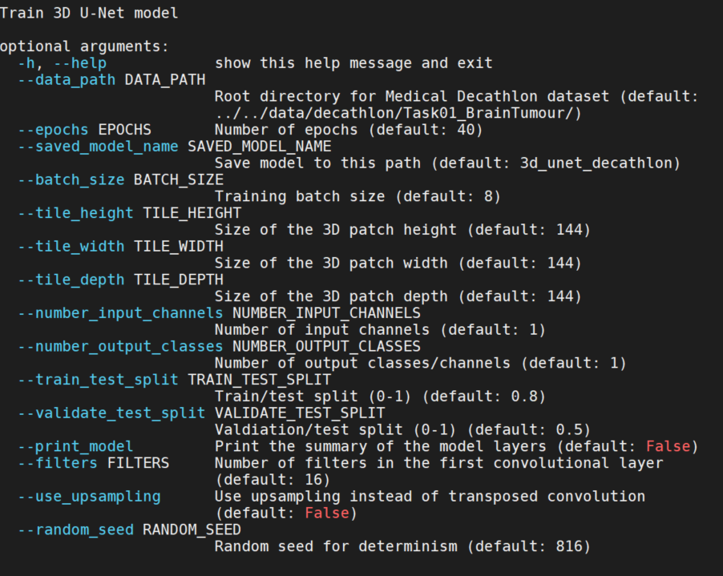
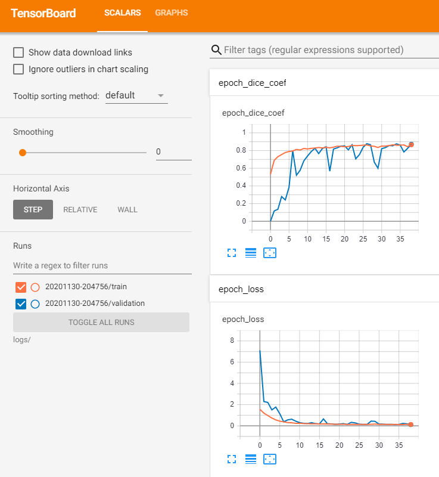

# 3D U-Net for Medical Decathlon Dataset

.

## Trains a 3D U-Net on the brain tumor segmentation ([BraTS](https://www.med.upenn.edu/sbia/brats2017.html)) subset of the [Medical Segmentation Decathlon dataset](http://medicaldecathlon.com/) dataset. 

This model can achieve a [Dice coefficient](https://www.ncbi.nlm.nih.gov/pmc/articles/PMC1415224/) of > 0.80 on the whole tumor using just the [FLAIR](https://en.wikipedia.org/wiki/Fluid-attenuated_inversion_recovery) channel.

### Steps to train a new model:

1. Go to the [Medical Segmentation Decathlon](http://medicaldecathlon.com) website and download the [BraTS subset](https://drive.google.com/file/d/1A2IU8Sgea1h3fYLpYtFb2v7NYdMjvEhU/view?usp=sharing). The dataset has the [Creative Commons Attribution-ShareAlike 4.0 International license](https://creativecommons.org/licenses/by-sa/4.0/).

2. Untar the "Task01_BrainTumour.tar" file:   
```
tar -xvf Task01_BrainTumour.tar
```
3. We use [conda virtual environments](https://www.anaconda.com/distribution/#download-section) to run Python scripts. Once you download and install conda, create a new conda environment with [TensorFlow* with Intel&reg; MKL-DNN](https://software.intel.com/en-us/articles/intel-optimization-for-tensorflow-installation-guide?page=1). Run the command: 
```
conda create -c anaconda -n decathlon pip python=3.6 tensorflow=2.2
```

This will create a new conda virtual environment called "decathlon" and install [TensorFlow* with Intel&reg; MKL-DNN](https://software.intel.com/en-us/articles/intel-optimization-for-tensorflow-installation-guide) for CPU training and inference.

4. Enable the new environment. Run the command: 
```
conda activate decathlon
```
5. Install the package [nibabel](http://nipy.org/nibabel/). Run the command: 
```
pip install nibabel
```
6. Run the command 
```
python train.py --data_path $DECATHLON_ROOT_DIRECTORY
```
where `$DECATHLON_ROOT_DIRECTORY` is the root directory where you un-tarred the Decathlon dataset.



NOTE: The default settings take a [Height, Width, Depth] = [144, 144, 144] crop of the original image and mask using 8 images/masks per training batch. This requires over [40 gigabytes](images/training_memory_3d_unet.png) of memory to train the model. We trained our model on an Intel&reg; Xeon&reg; 8180 server with 384 GB of RAM. If you don't have enough memory or are getting out of memory (OOM) errors, you can pass `--tile_height=64 --tile_width=64 --tile_depth=64` to the `train.py` which will use a smaller ([64,64,64]) crop. You can also consider smaller batch sizes (e.g. `--batch_size=4` for a batch size of 4).



### Displaying the Results

There are many programs that will display [Nifti](https://nifti.nimh.nih.gov/) 3D files.  For the images above and below, the red overlay is the prediction from the model and the blue overlay is the ground truth mask. Any purple voxels are true positives.


 

 


REFERENCES:
1. Menze BH, Jakab A, Bauer S, Kalpathy-Cramer J, Farahani K, Kirby J, Burren Y, Porz N, Slotboom J, Wiest R, Lanczi L, Gerstner E, Weber MA, Arbel T, Avants BB, Ayache N, Buendia P, Collins DL, Cordier N, Corso JJ, Criminisi A, Das T, Delingette H, Demiralp Γ, Durst CR, Dojat M, Doyle S, Festa J, Forbes F, Geremia E, Glocker B, Golland P, Guo X, Hamamci A, Iftekharuddin KM, Jena R, John NM, Konukoglu E, Lashkari D, Mariz JA, Meier R, Pereira S, Precup D, Price SJ, Raviv TR, Reza SM, Ryan M, Sarikaya D, Schwartz L, Shin HC, Shotton J, Silva CA, Sousa N, Subbanna NK, Szekely G, Taylor TJ, Thomas OM, Tustison NJ, Unal G, Vasseur F, Wintermark M, Ye DH, Zhao L, Zhao B, Zikic D, Prastawa M, Reyes M, Van Leemput K. "The Multimodal Brain Tumor Image Segmentation Benchmark (BRATS)", IEEE Transactions on Medical Imaging 34(10), 1993-2024 (2015) DOI: 10.1109/TMI.2014.2377694

2. Bakas S, Akbari H, Sotiras A, Bilello M, Rozycki M, Kirby JS, Freymann JB, Farahani K, Davatzikos C. "Advancing The Cancer Genome Atlas glioma MRI collections with expert segmentation labels and radiomic features", Nature Scientific Data, 4:170117 (2017) DOI: 10.1038/sdata.2017.117

3. Simpson AL, Antonelli M, Bakas S, Bilello M, Farahani K, van Ginneken B, Kopp-Schneider A, Landman BA, Litjens G, Menze B, Ronneberger O, Summers RM, Bilic P, Christ PF, Do RKG, Gollub M, Golia-Pernicka J, Heckers SH, Jarnagin WR, McHugo MK, Napel S, Vorontsov E, Maier-Hein L, Cardoso MJ. "A large annotated medical image dataset for the development and evaluation of segmentation algorithms." https://arxiv.org/abs/1902.09063 

### Optimization notice
Please see our [optimization notice](https://software.intel.com/en-us/articles/optimization-notice#opt-en).

